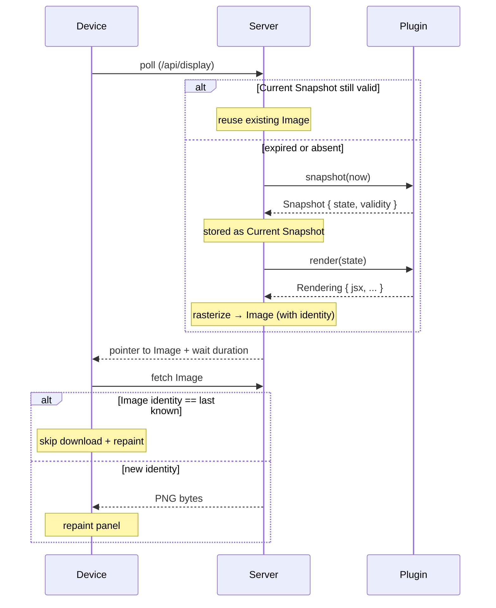

# trmnl-byos-deno

A self-hosted BYOS ("bring your own server") backend for a single TRMNL e-ink **Device**. The **Server** orchestrates one **Plugin** and projects its data into responses the **Device** pulls on its own clock.

The user-facing intent: the **Device** is inconspicuous decor most of the time and becomes informative only when the **Plugin** has something time-relevant to show. Multi-mode orchestration (a scheduler or layout that switches between e.g. BVG, calendar, photo) is a North Star and lives *inside* a future Super-**Plugin** that imports and composes other **Plugins** as plain code — never in the **Server**. The contract is already composable through normal function calls, so no special **Server**-side affordance is needed for orchestration.

## Language

**Device**:
The TRMNL e-ink display. There is exactly one. It pulls from the **Server** on its own clock; the **Server** never pushes. Its wire-level model is intentionally narrow: ask "anything new since last time?", if so fetch the **Image** at the pointer the **Server** gives, then wait the duration the **Server** specifies and ask again. It is unaware of **Snapshot**, **Rendering**, **Plugin**, or any upstream concept.
_Avoid_: client, panel, board (in this context).

**Server**:
The Deno process that sits between consumers and the **Plugin**. Holds the **Plugin**'s commitments and projects them to whoever asks: the **Device** (which asks about now and is served the BYOS HTTP responses it expects) and the dashboard preview (which asks about an arbitrary `t` without disturbing what the **Device** sees).
_Avoid_: service, backend.

**Plugin**:
A user-authored module the **Server** orchestrates. Its architectural surface is a pair: `snapshot(t) → Snapshot` (what the **Plugin** offers as its public state at time `t`) and `render(state) → Rendering` (the **Plugin**'s answer to the **Server**'s question "given this state, how would you draw it?"). The **Plugin**'s public interface is the structured data it commits to via **Snapshot**; the **Rendering** is downstream, produced on demand. The **Plugin** owns its own internal state (caches, timers, fetched data); the **Server** does not govern that. Replaces the older term "template".
_Avoid_: template, app.

**Snapshot**:
The **Plugin**'s commitment for a given `t` (a `Temporal.ZonedDateTime`): the structured public state of the **Plugin** at that moment, plus `validity` (a `Temporal.Duration`) saying how long the state stays valid from `t` onward. The data — not the visualization — is what carries the **validity**. From the author's perspective, `snapshot(t)` is either "fetch / derive my current data" (data-driven **Plugins** like BVG) or "give my time-indexed state at `t`" (deterministic **Plugins** like a calendar or a photo rotation) — both framings produce the same contract. Once given, a **Snapshot** is stable for its declared window. The **Server** does not store absolute expiry times; it derives them as needed from `(t, validity)`.
_Avoid_: frame (deprecated), result, response.

**Rendering**:
The **Plugin**'s preference for how to draw a **Snapshot**'s state. Returned from `render(state)` when the **Server** asks. Carries the JSX today and is structurally extensible to additional rendering preferences in the future (dither hints, panel regions, etc.). A **Rendering** is *not* the final pixels — those are the **Image**, produced downstream by the **Server**. By contract, `render` is dynamic: the **Server** may ask it whenever bytes are needed and does not assume any particular answer. **Plugin** authors are encouraged (not forced) to make `render` a pure function of `state`; doing so lets the **Server** cache the **Image** by `state` identity.
_Avoid_: frame, view, image, preferences (too generic on its own).

**Current Snapshot**:
The **Plugin**'s commitment for the present moment: the **Snapshot** the **Server** asked for at some `t` in the recent past, paired with that `t`. The **Device** is shown the **Image** rasterized from the **Rendering** of the **Current Snapshot** until its window `[t, t.add(validity))` is up, at which point the next **Device** poll produces the next one.
_Avoid_: active state, live frame, current frame.

**Image**:
The rasterized PNG bytes the **Device** fetches and displays. Produced by the **Server** from a **Rendering** (via the rasterizer + dither pipeline). Carries a stable **identity** (today: a content-hash filename, per ADR-0008) so the **Device** can detect "no change since last fetch" and skip both the download and the e-ink refresh. The **Image** is the only artifact crossing the **Server**/**Device** boundary; the **Device** sees nothing of **Snapshot**, **Rendering**, or **Plugin**.
_Avoid_: frame, picture, output, render.

## Relationships

- One **Server** orchestrates exactly one **Plugin**.
- One **Server** serves exactly one **Device**.
- A **Plugin** exposes `snapshot(t) → Snapshot` (the **Plugin**'s offering) and `render(state) → Rendering` (the **Server**'s question). The **Snapshot** carries the validity; the **Rendering** is asked for on demand.
- The **Server** holds the **Current Snapshot**, asks `render` when it needs to produce an **Image**, rasterizes that **Rendering** to PNG bytes, and serves the **Image** to the **Device** until the **Current Snapshot**'s window is up. Whether the **Server** also holds future **Snapshots** is a per-**Plugin** opt-in, not a default behavior.
- The **Device** initiates every interaction; the **Server** never pushes. The **Device** only knows about the **Image** (with its identity) and the wait duration.
- Caching happens at multiple layers. Server-side: identical `state` (when `render` is pure) → identical **Image** → reused PNG bytes. Device-side: identical **Image** identity → skipped download and skipped e-ink refresh. Render purity is best practice but not enforced — a **Plugin** that returns different JSX for the same state is contract-compliant; it just opts out of the **Server**-side cache benefit.

## Lifecycle (Device poll)

## Example dialogue

> **Dev:** "What happens when the dashboard opens but no **Device** has polled yet?"
>
> **Domain expert:** "There's no **Current Snapshot** yet. The dashboard calls `snapshot(now)` itself and treats the result as the **Current Snapshot** — same effect as a **Device** poll."
>
> **Dev:** "And if I scrub forward on the dashboard?"
>
> **Domain expert:** "That doesn't touch the **Current Snapshot**. It just calls `snapshot(t)` for the scrubbed `t` and renders that state via `render` — a hypothetical view, not a new **Current Snapshot**."
>
> **Dev:** "How does a Super-**Plugin** work that wants to show BVG in the morning and a photo otherwise?"
>
> **Domain expert:** "It's just a **Plugin** that imports the BVG and photo **Plugins**, calls their `snapshot(t)` to inspect their structured state, and routes by its own schedule. It can read sub-**Plugin** state without rendering. The **Server** sees one **Plugin**; the orchestration is plain code inside it."

## Flagged ambiguities

- "template" in the codebase refers to what we now call **Plugin** — rename pending.
- "Frame" was an earlier term that conflated the **Plugin**'s data commitment with its visualization. Now split: the data commitment is **Snapshot**; the visualization is **Rendering**. ADR-0008's "filename derived from rendered HTML" still applies but is conceptually a function of **Snapshot.state** going forward.

## Open questions

- **Caller intent in `snapshot`** — whether a future **Plugin** should be able to distinguish a real **Device** poll from a dashboard scrub. Not categorically forbidden; deferred until a concrete **Plugin** needs it. ADR-0005's prohibition was scoped to a `kind: "preview" | "device"` flag in the older contract and does not automatically apply to this question.
- **DeviceReport surface** — ambient, possibly-stale data the **Device** sends in its poll headers (battery, RSSI, model, etc.). Not load-bearing — most **Plugins** won't care. If a concrete **Plugin** needs it, we'll design a small auxiliary surface for reading the latest **DeviceReport**; until then it's not part of the **Plugin** contract.
- **Future Snapshots** — whether the **Server** should ever hold or pre-commit to **Snapshots** for `t > now`. No concrete use case today; if a **Plugin** ever wants to express "I can commit to future **Snapshots** safely," that's a **Plugin** opt-in, not a default **Server** behavior.
- **Multi-device** — today there is exactly one **Device**. The **Plugin** contract is deliberately written without baked-in single-device assumptions so that a future multi-device model can be added without breaking it.
