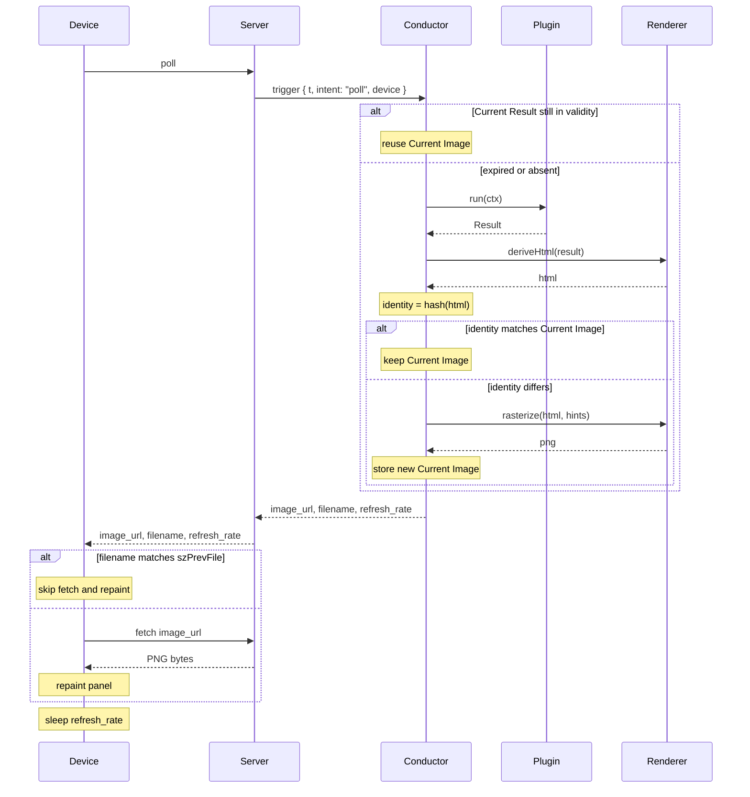

# trmnl-byos-deno

An opinionated, personal back end for a single TRMNL e-ink **Device**, written by and for an
engineer comfortable in code — not a general-purpose product. The repository name reflects the wire
protocol it happens to speak (TRMNL's "bring your own server"), not its scope. The **Server**
orchestrates one **Plugin** and serves an **Image** whenever the **Device** polls. The **Plugin**
contract is small enough that **Plugins** compose as plain code — a Super-**Plugin** can import
others and route between them with no **Server**-side machinery. Intent: the **Device** is
inconspicuous decor most of the time, becoming informative only when the **Plugin** has
time-relevant data.

## Language

**Device**: The TRMNL e-ink display. Exactly one in this system; pulls from the **Server** on its
own clock. _Avoid_: client, panel, board.

**Server**: The Deno process that hosts the HTTP layer and wires the **Conductor**, **Renderer**,
and the loaded **Plugin** together. Receives Device polls; hands them to the Conductor; returns the
Conductor's Image to the Device. _Avoid_: service, backend.

**Plugin**: A user-authored module exposing one method: `run(ctx) → Result`. The Result carries the
Plugin's data, the duration that data stands for, optional rasterization hints, and the view
component that turns the data into JSX. _Avoid_: template, app.

**RunContext**: The single argument to `run`. Always contains `t: Temporal.ZonedDateTime`, an
`intent` (Device poll, dashboard scrub, prerender warm-up), and a `device` (latest
heartbeat-derived telemetry). Open-shaped — more fields may be added non-breakingly over time;
Plugins read what they need and ignore the rest. _Avoid_: bag, params, options.

**Result**: What `run(ctx)` returns — `{ state, validity, hints?, view }`. `state` is the Plugin's
public data shape; `validity` is the duration that data stands for; `hints` are optional
rasterization hints the Renderer may consult; `view` is the JSX component `(state) => JSXElement`
the Renderer invokes with `state`. `view` rides in the Result (not as static Plugin config) because
view and state are type-locked and because it makes Super-Plugin composition mechanical.
_Avoid_: sample, snapshot, presentation, output.

**Conductor**: The per-poll orchestrator. Holds the **Current Result** and the **Current Image**.
For each trigger (Device poll, dashboard scrub, prerender warm-up) decides whether to call
`Plugin.run`, whether to re-derive HTML, whether to re-rasterize, and whether to reuse what it
already has. Owns identity computation. _Avoid_: pipeline, manager, orchestrator (the role
description, not the name).

**Renderer**: An internal Server module — a pair of stateless functions. `deriveHtml(result)`
invokes `result.view(result.state)` and runs `renderToString` to produce an HTML string.
`rasterize(html, hints)` talks to a CDP sidecar to screenshot the HTML at the active panel's
geometry, applies dither, and returns PNG bytes. The CDP sidecar is one implementation detail of
`rasterize`; the Renderer's identity as a Server module is independent of it. _Avoid_: CDP,
sidecar, headless-browser — those are how this Renderer happens to do its job.

**Image**: The PNG bytes the Server hands to the Device. Carries an identity (a hash of the HTML
that produced these bytes) the Device caches against. The Image is the only artifact crossing the
Server/Device boundary. _Avoid_: frame, picture, output.

**Current Result**: The Result the Conductor is currently honoring — the latest
`{ state, validity, hints?, view }` paired with the `RunContext` it was committed at. Replaced when
validity expires (or earlier, when a prerender warm-up runs). _Avoid_: current sample, current
snapshot.

**Current Image**: The Image the Conductor is currently serving — `{ png, identity }`. Replaced
only when a fresh `deriveHtml + rasterize` produces a different identity (see ADR-0004).

## Relationships

- One Server orchestrates exactly one Plugin and serves exactly one Device.
- The Conductor has three trigger kinds: a Device poll (asks about now), a dashboard scrub (asks
  about an arbitrary `t`), and a prerender warm-up (asks about a near-future `t` so the Image is
  ready when the Device's next poll arrives — see ADR-0007).
- The Device initiates every Device-driven interaction; the Server never pushes.
- The Image is the only artifact crossing the Server/Device boundary; the Device is unaware of
  Result, Plugin, view, or Conductor.
- A Plugin owns its own internal state (caches, timers, fetched data); the Conductor does not
  govern it.
- `RunContext.t` is a `Temporal.ZonedDateTime`; `Result.validity` is a `Temporal.Duration`.
- **Image identity** is derived from the HTML the Plugin's view produces. The Conductor reuses the
  Current Image when a fresh HTML hashes to the same identity; the Device caches by
  `filename = identity`. The hash function and length are encapsulated; see ADR-0004.
- Multi-mode composition (e.g. BVG mornings, photo otherwise) lives inside a Super-Plugin that
  imports other Plugins as plain code — never in the Server or the Conductor.

## Lifecycle (Device poll)

Pipeline (one full pass, no skips):
`Device poll → Conductor → Plugin.run(ctx) → Result → Renderer.deriveHtml(result) → Renderer.rasterize(html, hints) → Image → Device`

The Conductor uses `Plugin.run` for every trigger kind (poll, scrub, prerender). The skip-point
inside the "expired" branch is after `deriveHtml`: if the new HTML hashes to the same value as the
Current Image's identity, reuse the Current Image (skip `rasterize`). Rasterize is the expensive
step; this is the save worth making.

For a dashboard scrub the Conductor runs the same pipeline at the arbitrary `t` the dashboard
supplies, returning the resulting Image to the dashboard without touching the Current Result or
Current Image.

For a prerender warm-up the Conductor anticipates the Device's next poll and runs the pipeline
ahead of time so the Current Image is hot when the Device actually polls (see ADR-0007).

## Static assets and styling

**Current behavior:** The Server serves `/preview/:id/assets/*` from the Plugin's folder on disk;
the PDG (Plugin Design Guide) and the base design-system stylesheet pull through this path. Asset
bytes are read live per render and are *not* included in **Image** identity, so an asset change only
takes effect after the Server restarts.

**Known gaps (deferred):**

- A Plugin is currently a folder by convention; the convention isn't part of the **Plugin**
  contract.
- Asset changes don't bust the **Current Image** because identity is HTML-only.
- Composition (a Super-Plugin pulling in sub-Plugins) has no defined asset story — nested folders,
  merged asset maps, render-time bundling, and fully-inline (data URIs) are all candidates.

The right shape needs pressure from a concrete Super-Plugin to expose real trade-offs. Until then,
current behavior stands; see the corresponding entry under **Open questions**.

## Example dialogue

> **Dev:** "What happens when the dashboard opens but no Device has polled yet?" **Domain expert:**
> "No Current Result exists. The dashboard's request goes through the Conductor exactly like a
> Device poll — `Plugin.run({ t: now, intent: 'scrub', device })`."

> **Dev:** "If I scrub forward, does the Device see anything different?" **Domain expert:** "No.
> Scrub calls `Plugin.run({ t, intent: 'scrub', device })` and runs the result through the Renderer
> for the dashboard — it doesn't touch the Current Result or Current Image."

> **Dev:** "How does a Super-Plugin show BVG at commute, photo otherwise?" **Domain expert:** "It's
> a Plugin whose factory imports both sub-Plugins. Its `run(ctx)` calls one or both sub-`run`s,
> picks the one to use, and returns a Result whose `state` carries which sub was picked plus that
> sub's inner state, and whose `view` invokes the chosen sub's view. The Server and Conductor see
> exactly one Plugin."

## Flagged ambiguities

- "template" in the codebase = **Plugin** (rename pending).
- "snapshot" / "present" / "Sample" / "Presentation" are gone from the target vocabulary —
  collapsed into `run` and `Result`. The codebase still uses the old names; rename pending.
- The content-hash filename (ADR-0004) is the **Image** identity at the wire.

## Open questions

- **`RunContext.device` contents** — exactly which heartbeat-derived fields populate it (battery,
  RSSI, last-seen timestamp, full DeviceReport, …). The RunContext shape is open; this is the
  open question about what fills one of its fields.
- **Future Results** — pre-committing for `t > now` beyond the prerender warm-up of the immediate
  next poll. No use case today.
- **Multi-device** — contract written without single-device assumptions; extends naturally if
  needed.
- **Result hint fields** — exact field names alongside `view` will land as concrete needs appear
  (dither, viewport, filters, etc.).
- **Plugin packaging and asset handling** — whether a Plugin is fundamentally a TS module or a
  folder convention, how assets reach the Renderer (inline data URIs, URL-served, or render-time
  bundle), whether asset contents contribute to **Image** identity, and how a Super-Plugin
  aggregates sub-Plugin assets without URL collisions. Linked sub-questions, all deferred until a
  concrete Super-Plugin drives the trade-offs. See "Static assets and styling".
