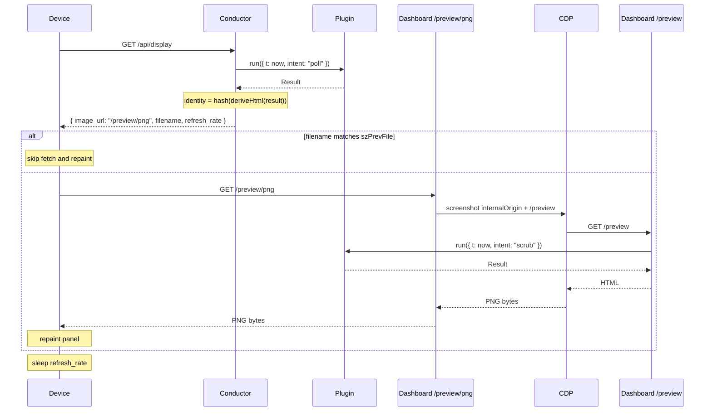

# trmnl-byos-deno

An opinionated, personal back end for a single TRMNL e-ink **Device**, written by and for an
engineer comfortable in code — not a general-purpose product. The repository name reflects the wire
protocol it happens to speak (TRMNL's "bring your own server"), not its scope. The **Server**
orchestrates one **Plugin** and serves an **Image** whenever the **Device** polls. The **Plugin**
contract is small enough that **Plugins** compose as plain code — a Super-**Plugin** can import
others and route between them with no **Server**-side machinery. Intent: the **Device** is
inconspicuous decor most of the time, becoming informative only when the **Plugin** has
time-relevant data.

## Language

**Device**: The TRMNL e-ink display. Exactly one in this system; pulls from the **Server** on its
own clock. _Avoid_: client, panel, board.

**Server**: The Deno process that hosts the HTTP layer and wires the **Conductor**, **Renderer**,
and the loaded **Plugin** together. Receives Device polls; hands them to the Conductor; returns the
Conductor's Image to the Device. _Avoid_: service, backend.

**Plugin**: A user-authored module exposing one method: `run(ctx) → Result`. The Result carries the
Plugin's data, the duration that data stands for, optional rasterization hints, and the view
component that turns the data into JSX. _Avoid_: template, app.

**RunContext**: The single argument to `run`. Always contains `t: Temporal.ZonedDateTime`, an
`intent` (`"poll"` for the Device's `/api/display` call, `"scrub"` for a dashboard or `/preview`
fetch; `"prerender"` is reserved but unused since ADR-0007 was withdrawn), and a `device` (latest
heartbeat-derived telemetry). Open-shaped — more fields may be added non-breakingly over time;
Plugins read what they need and ignore the rest. _Avoid_: bag, params, options.

**Result**: What `run(ctx)` returns — `{ state, validity, hints?, view }`. `state` is the Plugin's
public data shape; `validity` is the duration that data stands for; `hints` are optional
rasterization hints the Renderer may consult; `view` is the JSX component `(state) => JSXElement`
the Renderer invokes with `state`. `view` rides in the Result (not as static Plugin config) because
view and state are type-locked and because it makes Super-Plugin composition mechanical. _Avoid_:
sample, snapshot, presentation, output.

**Conductor**: Hosts the BYOS surface (`/api/setup`, `/api/display`, `/api/log`, `/assets/*`) and
exposes a single `derive(t, intent?)` for peers that want to run the Plugin and turn its Result into
HTML + identity. Holds no rendered-PNG cache (ADR-0004); the only mutable state it carries between
requests is `latestDevice`, the most-recent DeviceReport parsed off a poll. _Avoid_: pipeline,
manager, orchestrator (the role description, not the name).

**Renderer**: An internal Server concept split across two functions, both stateless.
`deriveHtml(result)` invokes `result.view(result.state)` and runs `renderToString` to produce an
HTML string — owned by the Conductor. `fetchPngFromUrl(url)` talks to a CDP sidecar to screenshot
the URL at the active panel's geometry, applies dither, and returns PNG bytes — owned by the
dashboard's `/preview/png` handler. The CDP sidecar is one implementation detail of
`fetchPngFromUrl`. _Avoid_: CDP, sidecar, headless-browser — those are how this Renderer happens to
do its job.

**Image**: The PNG bytes the Server hands to the Device. The Server never holds a rendered Image in
memory across requests — `/preview/png` produces fresh bytes on every call. The Image carries an
identity (a hash of the HTML that produced its source render) that the Device caches against via the
`filename` field on `/api/display`. _Avoid_: frame, picture, output.

## Relationships

- One Server orchestrates exactly one Plugin and serves exactly one Device.
- The Plugin runs on two triggers: a Device poll (intent `"poll"`, asks about now — through
  `/api/display`) and a `/preview` fetch (intent `"scrub"`, asks about whatever `t` the caller
  supplied — through CDP for the Device-facing PNG and direct from the browser for the dashboard).
- The Device initiates every Device-driven interaction; the Server never pushes.
- The Image is the only artifact crossing the Server/Device boundary; the Device is unaware of
  Result, Plugin, view, or Conductor.
- A Plugin owns its own internal state (caches, timers, fetched data); the Conductor does not govern
  it.
- `RunContext.t` is a `Temporal.ZonedDateTime`; `Result.validity` is a `Temporal.Duration`.
- **Image identity** is derived from the HTML the Plugin's view produces. The Conductor returns it
  as `filename` from `/api/display`; the Device's firmware compares it against the previous poll's
  filename and skips both the download and the e-ink refresh when it matches. The hash function and
  length are encapsulated; see ADR-0004.
- Multi-mode composition (e.g. BVG mornings, photo otherwise) lives inside a Super-Plugin that
  imports other Plugins as plain code — never in the Server or the Conductor.

## Lifecycle (Device poll)

Two HTTP hops per cycle. The first computes metadata; the second produces the pixels.

The Plugin runs twice per Device cycle. There is no server-side render cache (ADR-0004) — every
Device fetch produces fresh pixels. The Device-side `filename` cache is the only dedupe that fires,
and it fires on the Device, not the Server.

For a dashboard scrub the dashboard handler calls `derive(t, "scrub")` to get Result metadata and
fetches the PNG via the same CDP hop pointed at `/preview?t=...`. The Server holds no "what the
dashboard last saw" state.

## Static assets and styling

**Current behavior:** The Server serves `/assets/*` from the Plugin's `assets/` directory on disk.
Both the dashboard `` preview and the CDP-screenshotted `/preview` resolve asset URLs through
this prefix. Asset bytes are read live per request and are _not_ included in **Image** identity, so
an asset change takes effect on the next render but does not by itself cause the Device's filename
cache to invalidate.

**Known gaps (deferred):**

- A Plugin is currently a folder by convention; the convention isn't part of the **Plugin**
  contract.
- Asset changes don't bust the Device's filename cache because identity is HTML-only.
- Composition (a Super-Plugin pulling in sub-Plugins) has no defined asset story — nested folders,
  merged asset maps, render-time bundling, and fully-inline (data URIs) are all candidates.

The right shape needs pressure from a concrete Super-Plugin to expose real trade-offs. Until then,
current behavior stands; see the corresponding entry under **Open questions**.

## Example dialogue

> **Dev:** "What happens when the dashboard opens but no Device has polled yet?" **Domain expert:**
> "The dashboard's request calls `derive(now, 'scrub')`. The Plugin runs with `ctx.device = null`.
> Nothing is pinned anywhere; the next Device poll runs the Plugin again."

> **Dev:** "If I scrub forward, does the Device see anything different?" **Domain expert:** "No.
> Scrub is just `Plugin.run({ t, intent: 'scrub', device })` rendered to a one-off PNG for the
> dashboard. The Server holds no rendered-PNG state, so there's nothing to disturb."

> **Dev:** "How does a Super-Plugin show BVG at commute, photo otherwise?" **Domain expert:** "It's
> a Plugin whose factory imports both sub-Plugins. Its `run(ctx)` calls one or both sub-`run`s,
> picks the one to use, and returns a Result whose `state` carries which sub was picked plus that
> sub's inner state, and whose `view` invokes the chosen sub's view. The Server and Conductor see
> exactly one Plugin."

## Flagged ambiguities

- "template" in the codebase = **Plugin** (rename pending).
- "snapshot" / "present" / "Sample" / "Presentation" are gone from the target vocabulary — collapsed
  into `run` and `Result`. The codebase still uses the old names; rename pending.
- The content-hash filename (ADR-0004) is the **Image** identity at the wire.

## Open questions

- **`RunContext.device` contents** — exactly which heartbeat-derived fields populate it (battery,
  RSSI, last-seen timestamp, full DeviceReport, …). The RunContext shape is open; this is the open
  question about what fills one of its fields.
- **Future Results** — pre-committing for `t > now` beyond the prerender warm-up of the immediate
  next poll. No use case today.
- **Multi-device** — contract written without single-device assumptions; extends naturally if
  needed.
- **Result hint fields** — exact field names alongside `view` will land as concrete needs appear
  (dither, viewport, filters, etc.).
- **Plugin packaging and asset handling** — whether a Plugin is fundamentally a TS module or a
  folder convention, how assets reach the Renderer (inline data URIs, URL-served, or render-time
  bundle), whether asset contents contribute to **Image** identity, and how a Super-Plugin
  aggregates sub-Plugin assets without URL collisions. Linked sub-questions, all deferred until a
  concrete Super-Plugin drives the trade-offs. See "Static assets and styling".
