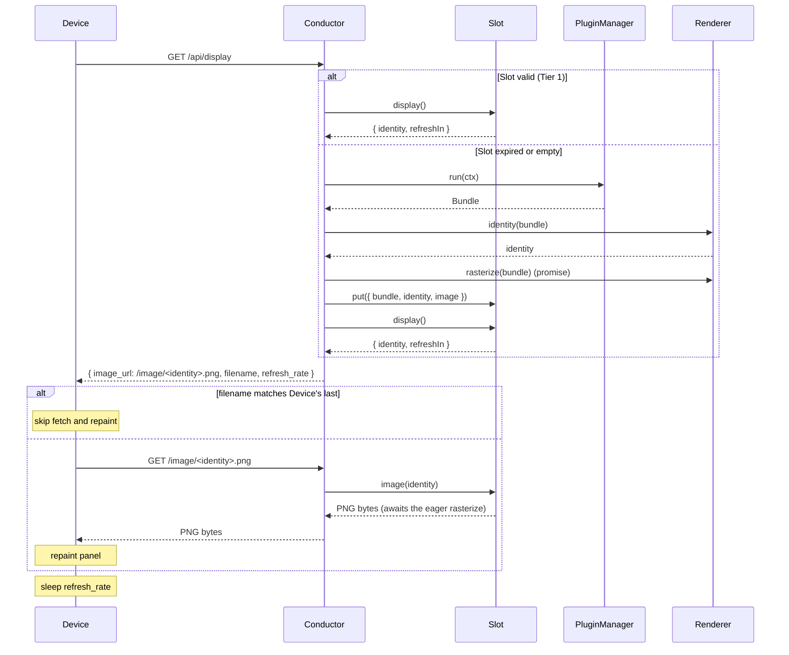

# trmnl-byos-deno

An opinionated, personal back end for a single TRMNL e-ink **Device**, written by and for an
engineer comfortable in code — not a general-purpose product. The repository name reflects the wire
protocol it happens to speak (TRMNL's "bring your own server"), not its scope. The **Server**
orchestrates one **Plugin** and serves one **Image** at a time. The **Plugin** contract is small
enough that **Plugins** compose as plain code — a Super-**Plugin** can import others and route
between them with no **Server**-side machinery. Intent: the **Device** is inconspicuous decor most
of the time, becoming informative only when the **Plugin** has time-relevant data.

## Language

**Device**: The TRMNL e-ink display. Exactly one in this system; pulls from the **Server** on its
own clock. _Avoid_: client, panel, board.

**Server**: The Deno process that hosts the HTTP layer and wires the **Conductor**,
**PluginManager**, **Renderer**, **Slot**, **Telemetry**, and the loaded **Plugin** together.
_Avoid_: service, backend.

**Plugin**: A user-authored module exposing one method: `run(ctx) → Result`. The Result carries the
Plugin's data, the duration that data stands for, optional rasterization hints, and the view
component that turns the data into JSX. Asset bytes live in `pluginDir/assets/` and are referenced
from view by their `/assets/...` URL path. _Avoid_: template, app.

**DesignSystem**: Shared visual vocabulary for **Plugin** views, shipped from `templates/ds/`.
Provides layout primitives (`Layout`, `Content`, `Grid`, `Flex`, `Columns`), typography (`Title`,
`Value`, `Label`, `Description`), the Item pattern (`meta + content + icon`), chrome overlays
(`StatusBar`, `BatteryIndicator`), and `EmptyState`. Components are individually importable; CSS
ships via a `<Styles />` component the Plugin author renders explicitly in `<head>`. A `<Page>`
document wrapper is the natural next promotion (see ADR-0008 §Surface and the "page wrapper" entry
below) — it owns `<html>/<head>/<body>` boilerplate and auto-renders `<Styles />` plus a charset,
title, and optional plugin override stylesheet. Framework-informed but project-native — adopts the
TRMNL Design Framework's e-ink research without its class-based API or marketplace orientation (see
ADR-0008). _Avoid_: framework, theme, UI kit.

**Page**: A `<Page>` DesignSystem component that owns the document skeleton — `<html lang>`,
`<head>` (charset, `<title>`, auto-`<Styles />`, optional plugin override
`<link rel="stylesheet">`), and `<body>`. Plugin children land directly inside `<body>`; the Plugin
still composes `<Layout>`, `<Content>`, `<StatusBar>` etc. inside as needed. The Page auto-renders
`<Styles />` on the Plugin's behalf — a deliberate softening of the cornerstone
(Server/Renderer/PluginManager still inject nothing; DS components compose each other freely once
the Plugin imports them). Plugins that don't want DS styling don't use `<Page>`; they hand-roll the
document the way `templates/example/root.tsx` did pre-Page. _Avoid_: Document, Frame, Screen.

**RunContext**: The single argument to `run`. Always contains `t: Temporal.ZonedDateTime`, an
`intent` (`"poll"` for the Device's `/api/display` call, `"scrub"` for a dashboard preview), and a
`device` (latest heartbeat-derived telemetry). Open-shaped — more fields may be added non-breakingly
over time; Plugins read what they need and ignore the rest. _Avoid_: bag, params, options.

**Result**: What `run(ctx)` returns — `{ state, validity, hints?, view }`. `state` is the Plugin's
public data shape; `validity` is the duration that data stands for; `hints` are optional
rasterization hints the Renderer may consult; `view` is the JSX component `(state) => JSXElement`
the Renderer invokes with `state`. `view` rides in the Result (not as static Plugin config) because
view and state are type-locked and because it makes Super-Plugin composition mechanical. _Avoid_:
sample, snapshot, presentation, output.

**Bundle**: What the **PluginManager** produces per call: `{ result, assets }`. `result` is what the
Plugin's `run` returned; `assets` is a `Record<urlPath, Uint8Array>` of every file in the Plugin's
`assets/` directory, keyed by the URL path the view references (e.g. `/assets/foo.svg`). A Bundle is
the unit of "everything the Renderer needs to produce one Image." _Avoid_: package, payload.

**PluginManager**: The thin module that owns the Plugin's lifecycle. It loads the Plugin module
once, reads its `assets/` directory into memory once, and exposes one method: `run(ctx) → Bundle`,
which calls `plugin.run(ctx)` and attaches the asset map. PluginManager does not derive HTML, does
not catch errors, does not interact with the Renderer. _Avoid_: loader, host.

**Renderer**: The deep module that owns everything from Bundle to Image. Public surface:
`identity(bundle) → string` (derives HTML internally, returns the Bundle's identity hash) and
`rasterize(bundle) → Uint8Array` (derives HTML internally, spins an internal HTTP server that serves
the Bundle's assets to a CDP sidecar, screenshots, dithers, returns PNG bytes). How screenshotting
works — CDP, the internal server, the dither pass — is encapsulated and not part of the public
surface. _Avoid_: CDP, sidecar, headless-browser.

**Slot**: The single-Image cache. Holds at most one entry: `{ bundle, identity, image, cachedAt }`,
where `image` is a `Promise<Uint8Array>` of PNG bytes (kicked off eagerly when the entry lands).
Four operations: `put(entry)` swaps the entry;
`display() → { identity, cachedAt, refreshIn } |
null` returns metadata if the entry's `validity`
hasn't elapsed (`cachedAt` + `refreshIn` bound the cached window the Dashboard draws);
`image(id) → bytes | null` returns bytes if `id` matches the entry's identity; `clear()`
invalidates. Slot has no Renderer or PluginManager dep — it stores what callers push in. _Avoid_:
cache (the unqualified word).

**Conductor**: The facade for the **Device** path. Hosts the BYOS surface (`/api/setup`,
`/api/display`, `/api/log`) and the `/image/<identity>.png` route. Orchestrates each cycle: parse
Device headers → report into DeviceState → call PluginManager → call Renderer.identity → start
Renderer.rasterize → push the trio into the Slot → return identity. On a caught throw anywhere in
that loop, the same loop re-runs with a fabricated error Bundle. _Avoid_: pipeline, manager.

**Dashboard**: The debug/observe add-on. Three routes: `GET /` (admin page showing the current
Image, the render trace, the scrub timeline, and the device section), `GET /dashboard/preview.png?t=...`
(transient preview render at arbitrary `t`, bypasses the Slot; returns the render's identity and
validity as response headers alongside the PNG), `POST /dashboard/clear` (invalidates the Slot).
Dashboard reads Telemetry to render the trace, reads the Slot's `display()` to know the current
Image identity and cached window, reads DeviceState to surface the latest DeviceReport + recent
`/api/log` bodies, and uses the same `/image/<identity>.png` URL the Device uses to show the
current Image. _Avoid_: admin, UI.

**Telemetry**: The singleton that holds the most-recent render trace — durations of plugin-run,
identity, and rasterize; the resulting identity; the error if one occurred. Conductor records;
Dashboard reads. One entry; replaced each render. _Avoid_: metrics, log.

**DeviceState**: The singleton that holds what the Device has reported about itself this process —
the latest parsed DeviceReport (so the next Plugin.run carries it forward across header-less polls)
and a small ring of recent `/api/log` bodies. Conductor writes both (`reportDevice` on
`/api/display`, `appendLog` on `/api/log`); Dashboard reads both for the device section. In-process
only — "since process start" is the honest framing; the server has no way to know when the Device
itself rebooted. _Avoid_: device session, device store.

**Image**: The PNG bytes the Server hands to the Device. The Slot caches one Image at a time, keyed
by `identity` (a hash of the Bundle's rendered HTML + asset bytes). The Device's firmware-side
filename cache matches against the identity returned in `/api/display`'s `filename` field. _Avoid_:
frame, picture, output.

**Super-Plugin**: A **Plugin** that composes other **Plugins** as plain code — imports them, calls
their `run`, inspects the returned **Result**s to route, and returns one Result of its own. The
**Server** and **Conductor** see a Super-Plugin as exactly one Plugin; the nesting is invisible to
them. All multi-mode display logic lives here, never in the Server (see ADR-0002). It floors every
Result's `validity` at 5 minutes as a battery policy — the **Device** is never told to poll sooner —
accepting that fast-moving content (the realtime **Transport** board) may run up to 5 minutes stale.
_Avoid_: orchestrator, router, manager.

**Transport**: The commute departure-board leaf **Plugin** — Berlin BVG journeys for the configured
routes, surfaced during commute windows. Its **Result** `state` carries a `Board` whose
`emptyReason` (`none` / `noScheduleApplicable` / `feedUnreachable`) is the signal a composing
**Super-Plugin** routes on, and whose quiet-state `validity` reports when the next commute window
opens. _Avoid_: departures, BVG (that is the upstream feed, not the Plugin).

**Gallery**: The full-screen photo leaf **Plugin** — rotates sequentially, time-indexed on `t`,
through a curated set of bundled images. It is the **Device**'s default quiet-state display: a
composing **Super-Plugin** shows the Gallery whenever **Transport** is schedule-quiet
(`emptyReason === "noScheduleApplicable"`), clamping the **Result** `validity` to
`min(Gallery, Transport)` (then floored at 5 minutes — see **Super-Plugin**) so an opening commute
window is woken into. Renders edge-to-edge, no chrome. _Avoid_: screensaver, slideshow, picture.

## Relationships

- One Server orchestrates exactly one Plugin and serves exactly one Device.
- PluginManager produces Bundles. Conductor calls Renderer to compute identity and start
  rasterization. The triple `(bundle, identity, image-promise)` lands in the Slot together.
- The Slot's entry is valid for `bundle.result.validity`. After it expires, the next request
  triggers a fresh render.
- Conductor's orchestration loop catches throws from Plugin or Renderer; on catch it builds an error
  Bundle and re-runs the same loop. The error Bundle goes through the Slot like any other.
- The Device initiates every Device-driven interaction; the Server never pushes.
- The Image is the only artifact crossing the Server/Device boundary; the Device is unaware of
  Result, Bundle, Plugin, view, Conductor, or Renderer.
- A Plugin owns its own internal state (caches, timers, fetched data); the Conductor does not govern
  it.
- `RunContext.t` is a `Temporal.ZonedDateTime`; `Result.validity` is a `Temporal.Duration`.
- **Image identity** is `hash(html + assets)`. The hash and its truncation are encapsulated inside
  Renderer (see ADR-0004). Conductor returns it as `filename` on `/api/display`; the Device's
  firmware compares against the previous poll's filename and skips both the download and the e-ink
  refresh when it matches.
- Multi-mode composition (e.g. BVG mornings, photo otherwise) lives inside a Super-Plugin that
  imports other Plugins as plain code — never in the Server or the Conductor.
- Every byte in a **Plugin**'s rendered HTML arrives via explicit **Plugin**-author import. The
  **Server**, **Renderer**, and **PluginManager** never inject styles, scripts, or assets behind the
  scenes. The **DesignSystem** is opt-in the same way: the Plugin imports and renders `<Styles />`
  explicitly (see ADR-0008).

## Lifecycle (Device poll)

One render per cycle, possibly zero if the Slot's `validity` hasn't elapsed. Three tiers of laziness
inside the Conductor's `/api/display` handler:

1. **Validity tier.** Slot's entry is still valid → return its identity; no Plugin run, no
   rasterize.
2. **Identity tier.** Slot expired → run Plugin, compute new identity. If it matches the old
   identity, refresh `cachedAt` only; no rasterize. (Not yet implemented; reserved for when the cost
   matters.)
3. **Render tier.** Identity differs (or Slot empty) → start rasterize, put
   `(bundle, identity,
   image-promise)` into the Slot, return new identity.

For a dashboard scrub at arbitrary `t`, Dashboard calls PluginManager + Renderer directly, bypassing
the Slot. The scrub render is transient — it doesn't populate the Slot, doesn't write Telemetry,
doesn't affect what the Device sees.

## Plugin packaging

A Plugin is a folder on disk:

- `main.ts` — default-exports a `{ run }` object satisfying the Plugin contract.
- `assets/` — any files referenced from `view` HTML. PluginManager reads the directory recursively
  at load time and exposes each file at `/assets/<path-relative-to-assets-dir>` inside every Bundle.
  Renderer's internal HTTP server serves these to CDP during screenshot.

Asset changes take effect on Plugin reload. The Bundle's asset bytes contribute to identity, so an
asset edit invalidates the Device's filename cache on the next poll.

## Example dialogue

> **Dev:** "What happens when the dashboard opens but no Device has polled yet?" **Domain expert:**
> "Dashboard calls PluginManager + Renderer directly with `t = now`, gets a Bundle, rasterizes it
> transiently, and shows the PNG. The Slot is untouched. The next Device poll runs the Plugin again
> into the Slot."

> **Dev:** "If I scrub forward, does the Device see anything different?" **Domain expert:** "No.
> Scrub is a transient render that doesn't touch the Slot. The Server holds no state about what the
> dashboard last saw."

> **Dev:** "How does a Super-Plugin show BVG at commute, photo otherwise?" **Domain expert:** "It's
> a Plugin whose module sets up both sub-Plugins and exports a `run` that dispatches between them
> based on `ctx.t`. Its Result's `view` invokes the chosen sub's view. The Server and Conductor see
> exactly one Plugin."

## Flagged ambiguities

- "template" in the codebase = **Plugin** (rename pending).
- "snapshot" / "present" / "Sample" / "Presentation" are gone from the target vocabulary — collapsed
  into `run` and `Result`. The codebase may still use the old names; rename pending.
- "Conductor" was used previously to cover both the Device facade and the broader orchestration; it
  now means strictly the Device facade. The orchestration is split across PluginManager, Renderer,
  Slot, and Telemetry.

## Open questions

- **`RunContext.device` contents** — exactly which heartbeat-derived fields populate it (battery,
  RSSI, last-seen timestamp, full DeviceReport, …). The RunContext shape is open; this is the open
  question about what fills one of its fields.
- **Future Results** — pre-committing for `t > now`. No use case today.
- **Multi-device** — contract written without single-device assumptions; extends naturally if
  needed.
- **Result hint fields** — exact field names alongside `view` will land as concrete needs appear
  (dither, viewport, filters, etc.).
- **Identity tier (Tier 2) implementation** — the design reserves an optimization where an expired
  Slot whose freshly-computed identity matches the previous one skips rasterize. Not built until the
  rasterize cost is shown to matter in practice.
