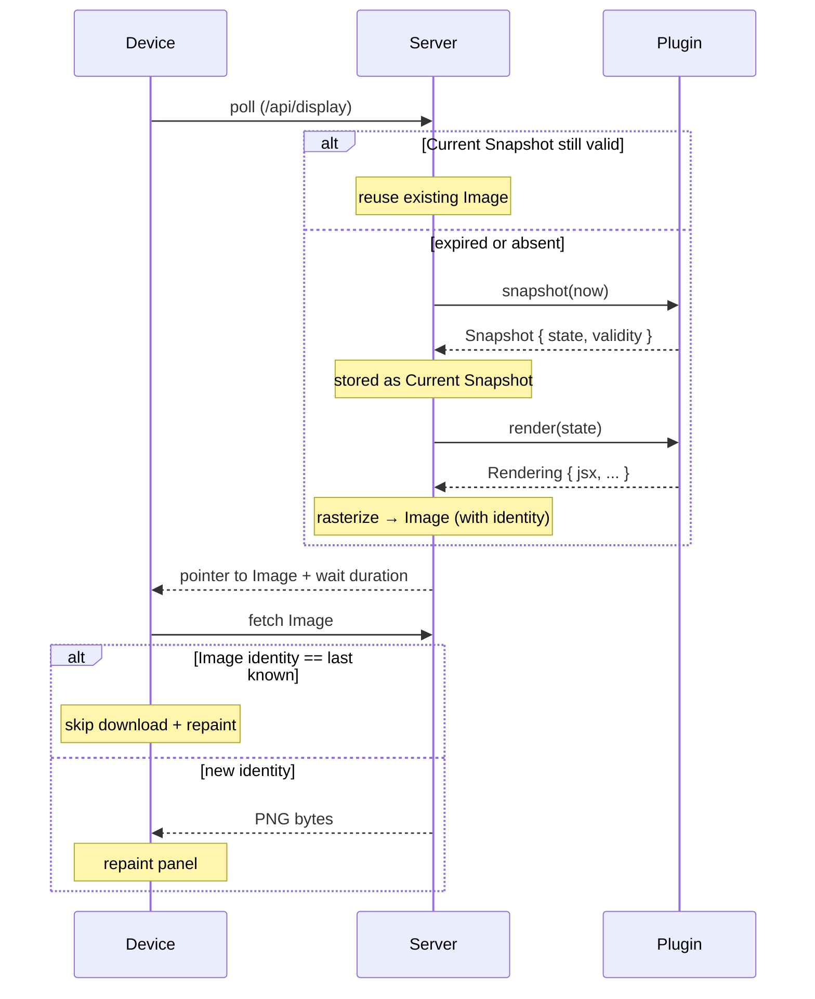

# trmnl-byos-deno

An opinionated, personal back end for a single TRMNL e-ink **Device**, written by and for an engineer comfortable in code — not a general-purpose product. The repository name reflects the wire protocol it happens to speak (TRMNL's "bring your own server"), not its scope. The **Server** orchestrates one **Plugin** and serves an **Image** whenever the **Device** polls. The **Plugin** contract is small enough that **Plugins** compose as plain code — a Super-**Plugin** can import others and route between them with no **Server**-side machinery. Intent: the **Device** is inconspicuous decor most of the time, becoming informative only when the **Plugin** has time-relevant data.

## Language

**Device**:
The TRMNL e-ink display. Exactly one in this system; pulls from the **Server** on its own clock.
_Avoid_: client, panel, board.

**Server**:
The Deno process between the **Device** and the **Plugin**. Holds the **Current Snapshot** and serves the **Image** derived from it.
_Avoid_: service, backend.

**Plugin**:
A user-authored module exposing `snapshot(t) → Snapshot` (data) and `render(state) → Rendering` (visualization).
_Avoid_: template, app.

**Snapshot**:
The **Plugin**'s public state at a moment `t`, paired with the `validity` for which that state stands.
_Avoid_: frame, result, response.

**Rendering**:
The **Plugin**'s drawing preference for a **Snapshot**'s state (JSX today; extensible).
_Avoid_: frame, view, image.

**Image**:
The rasterized PNG bytes derived from a **Rendering**, with an identity the **Device** caches against.
_Avoid_: frame, picture, output.

**Current Snapshot**:
The **Snapshot** the **Server** is honoring right now, paired with the `t` it was committed at.
_Avoid_: active state, live frame, current frame.

## Relationships

- One **Server** orchestrates exactly one **Plugin** and serves exactly one **Device**.
- The **Server** has two consumers of a **Plugin**'s output: the **Device** (asks about now) and the dashboard preview (asks about an arbitrary `t`).
- The **Device** initiates every interaction; the **Server** never pushes.
- The **Image** is the only artifact crossing the **Server**/**Device** boundary; the **Device** is unaware of **Snapshot**, **Rendering**, or **Plugin**.
- A **Plugin**'s public interface is the **Snapshot** (data). A **Rendering** is downstream — asked for on demand, dynamic by contract.
- A **Plugin** owns its own internal state (caches, timers, fetched data); the **Server** does not govern it.
- `t` is a `Temporal.ZonedDateTime`; `validity` is a `Temporal.Duration`.
- Server-side cache: when `render` is pure on `state`, identical `state` → identical **Image** → reused bytes.
- Device-side cache: identical **Image** identity → skipped download and skipped panel refresh.
- Multi-mode composition (e.g. BVG mornings, photo otherwise) lives inside a Super-**Plugin** that imports other **Plugins** as plain code — never in the **Server**.

## Lifecycle (Device poll)

## Example dialogue

> **Dev:** "What happens when the dashboard opens but no **Device** has polled yet?"
> **Domain expert:** "No **Current Snapshot** exists. The dashboard calls `snapshot(now)` itself — same effect as a **Device** poll."

> **Dev:** "If I scrub forward, does the **Device** see anything different?"
> **Domain expert:** "No. Scrub calls `snapshot(t)` for a hypothetical `t` and renders it — doesn't touch the **Current Snapshot**."

> **Dev:** "How does a Super-**Plugin** show BVG at commute, photo otherwise?"
> **Domain expert:** "It's a **Plugin** that imports both, calls their `snapshot(t)` to inspect state, and routes by its own schedule. The **Server** sees one **Plugin**."

## Flagged ambiguities

- "template" in the codebase = **Plugin** (rename pending).
- ADR-0008's content-hash filename is the **Image** identity at the wire.

## Open questions

- **Caller intent in `snapshot`** — distinguishing a **Device** poll from a dashboard scrub. Deferred; ADR-0005's prohibition was scoped to a different flag.
- **DeviceReport surface** — ambient, stale data from poll headers (battery, RSSI, etc.). Out of the **Plugin** contract until a concrete **Plugin** asks.
- **Future Snapshots** — pre-committing for `t > now`. No use case today.
- **Multi-device** — contract written without single-device assumptions; extends naturally if needed.
