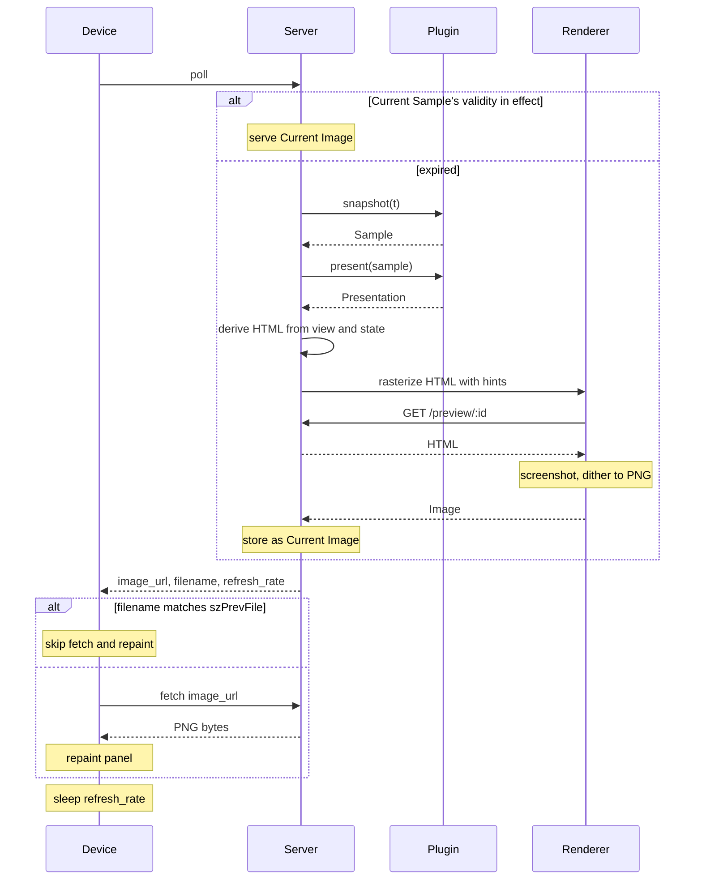

# trmnl-byos-deno

An opinionated, personal back end for a single TRMNL e-ink **Device**, written by and for an
engineer comfortable in code — not a general-purpose product. The repository name reflects the wire
protocol it happens to speak (TRMNL's "bring your own server"), not its scope. The **Server**
orchestrates one **Plugin** and serves an **Image** whenever the **Device** polls. The **Plugin**
contract is small enough that **Plugins** compose as plain code — a Super-**Plugin** can import
others and route between them with no **Server**-side machinery. Intent: the **Device** is
inconspicuous decor most of the time, becoming informative only when the **Plugin** has
time-relevant data.

## Language

**Device**: The TRMNL e-ink display. Exactly one in this system; pulls from the **Server** on its
own clock. _Avoid_: client, panel, board.

**Server**: The Deno process between the **Device** and the **Plugin**. Holds the **Current Sample**
and the **Current Image**; routes Device polls through the render pipeline. _Avoid_: service,
backend.

**Plugin**: A user-authored module exposing two methods: `snapshot(t) → Sample` (the data side) and
`present(sample) → Presentation` (the rendering specification — view component plus any
rasterization hints). _Avoid_: template, app.

**Sample**: The Plugin's public state at moment `t`, paired with the `validity` for which that state
stands. `validity` plays three roles, all "fresh-for-this-duration": Plugin's data-freshness
commitment, Server's "don't re-snapshot until this is up", Device's `refresh_rate` (sleep until next
poll). _Avoid_: snapshot (the verb stays for the method; the noun for the tuple is Sample).

**Presentation**: What `present(sample)` returns — `{ view, ...hints }` where `view` is a component
reference `(state) => JSXElement` the Renderer invokes with `sample.state`, and the remaining fields
are rasterization hints (dither, viewport, filters, etc.) the Renderer may consult. _Avoid_:
rendering, spec.

**Image**: The rasterized PNG bytes the Server produces by running a Presentation through the render
pipeline (view + state → HTML → screenshot → dither → PNG). Carries an identity (HTML hash) the
Device caches against. _Avoid_: frame, picture, output.

**Current Sample**: The Sample the Server is currently honoring — the latest `{ state, validity }`
paired with the `t` it was committed at. Replaced on re-snapshot. _Avoid_: current snapshot.

**Current Image**: The Image the Server is currently serving — `{ png, identity }` where identity is
the HTML hash that produced these bytes. Replaced only when a fresh render produces a different
identity (see ADR-0004).

**Renderer**: The abstract participant that turns HTML into PNG bytes — internally fetches HTML back
from the Server (via `/preview/:id`), screenshots, and dithers. Implemented today by a CloakBrowser
CDP sidecar; the Plugin and Server speak to it as a single abstraction. _Avoid_: CDP,
headless-browser (those are the implementation).

## Relationships

- One Server orchestrates exactly one Plugin and serves exactly one Device.
- The Server has two consumers of Plugin output: the Device (asks about now) and the dashboard
  preview (asks about an arbitrary `t`).
- The Device initiates every interaction; the Server never pushes.
- The Image is the only artifact crossing the Server/Device boundary; the Device is unaware of
  Sample, Presentation, Plugin, or the view.
- `snapshot` and `present` are always called as a pair — every Sample feeds a Presentation.
- A Plugin owns its own internal state (caches, timers, fetched data); the Server does not govern
  it.
- `t` is a `Temporal.ZonedDateTime`; `validity` is a `Temporal.Duration`.
- Image identity = `sha256(html).hex.slice(0, 16)`. The Server reuses the Current Image when a fresh
  HTML hashes to the same identity; the Device caches by `filename = identity`. See ADR-0004.
- Multi-mode composition (e.g. BVG mornings, photo otherwise) lives inside a Super-Plugin that
  imports other Plugins as plain code — never in the Server.

## Lifecycle (Device poll)

Pipeline:
`t → snapshot(t) → Sample → present(sample) → Presentation → derive HTML → rasterize → Image → Device`

`snapshot` and `present` are always paired — every time the Server calls `snapshot`, it calls
`present` immediately after with the resulting Sample. (`present` is cheap, so there's no incentive
to skip it.)

The only skip-point inside the "expired" branch is after `derive HTML`: if the new HTML hashes to
the same value as the Current Image's identity, reuse the Current Image (skip `rasterize`). Raster
is the expensive step; this is the save worth making.

## Example dialogue

> **Dev:** "What happens when the dashboard opens but no Device has polled yet?" **Domain expert:**
> "No Current Sample exists. The dashboard calls `snapshot(now)` itself and follows up with
> `present(sample)` — same effect as a Device poll."

> **Dev:** "If I scrub forward, does the Device see anything different?" **Domain expert:** "No.
> Scrub calls `snapshot(t) + present(sample)` for a hypothetical `t` and runs the resulting
> Presentation through the pipeline — doesn't touch the Current Sample or Current Image."

> **Dev:** "How does a Super-Plugin show BVG at commute, photo otherwise?" **Domain expert:** "It's
> a Plugin that imports both, calls their `snapshot(t)` to inspect state, picks one, and forwards
> through its own `present()` to assemble the chosen sub-Plugin's view into its own JSX. The Server
> sees one Plugin."

## Flagged ambiguities

- "template" in the codebase = **Plugin** (rename pending).
- "snapshot" stays as the method's verb; the tuple it returns is a **Sample** (not a Snapshot).
- The content-hash filename (ADR-0004) is the **Image** identity at the wire.

## Open questions

- **Caller intent in `snapshot` / `present`** — distinguishing a Device poll from a dashboard scrub.
  Deferred; ADR-0006's prohibition was scoped to a different flag.
- **DeviceReport surface** — ambient, stale data from poll headers (battery, RSSI, etc.). Out of the
  Plugin contract until a concrete Plugin asks.
- **Future Samples** — pre-committing for `t > now`. No use case today.
- **Multi-device** — contract written without single-device assumptions; extends naturally if
  needed.
- **Presentation hint fields** — exact field names alongside `view` will land as concrete needs
  appear (dither, viewport, filters, etc.).
